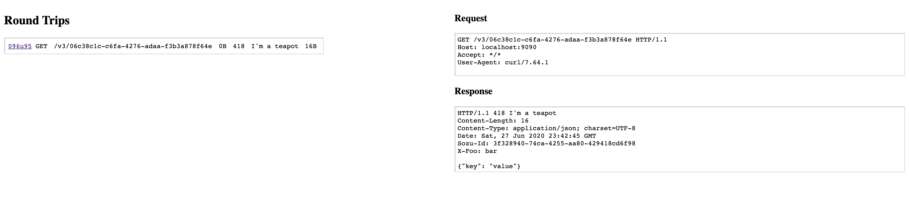

# `smock`

A server mock.

## Installation

### Mac

```bash
$ brew tap broothie/smock
$ brew install smock
```

### Releases

Releases are available on the [releases page](https://github.com/broothie/smock/releases).

### Source

You can also build from source of course if you have the Go toolchain installed and feel like doing that.

## Usage

Start a mock server:
```bash
$ smock -c 201 -h Content-Type=application/json -b '{"key": "value"}'
[smock] mock server @ http://localhost:9090
[smock] serving ui @ http://localhost:9091
```

then, in another terminal, hit the server:
```bash
$ curl -i localhost:9090
HTTP/1.1 201 Created
Content-Type: application/json
Date: Sat, 27 Jun 2020 23:39:43 GMT
Content-Length: 16

{"key": "value"}
```

### Proxying

Start smock proxied toward a uri:

```bash
$ smock proxy https://run.mocky.io
```

then:

```bash
$ curl -i localhost:9090/v3/06c38c1c-c6fa-4276-adaa-f3b3a878f64e
HTTP/1.1 418 I'm a teapot
Content-Length: 16
Content-Type: application/json; charset=UTF-8
Date: Sat, 27 Jun 2020 23:42:45 GMT
Sozu-Id: 3f328940-74ca-4255-aa80-429418cd6f98
X-Foo: bar

{"key": "value"}
```

### UI

And check it out - there's even a UI where you can see your requests coming through in real time!



## All Options
```bash
$ smock --help-long
usage: smock [<flags>] <command> [<args> ...]

Flags:
      --help               Show context-sensitive help (also try --help-long and
                           --help-man).
  -p, --port=9090          port to run server mock on
  -u, --uiport=9091        port to run ui on
      --no-ui              disable ui
  -c, --code=200           response status code
  -h, --header=HEADER ...  response headers
  -b, --body=""            response body

Commands:
  help [<command>...]
    Show help.


  version
    print smock version


  mock [<flags>]
    mock response

    -c, --code=200           response status code
    -h, --header=HEADER ...  response headers
    -b, --body=""            response body

  proxy <url>
    reverse proxy to target url
```
